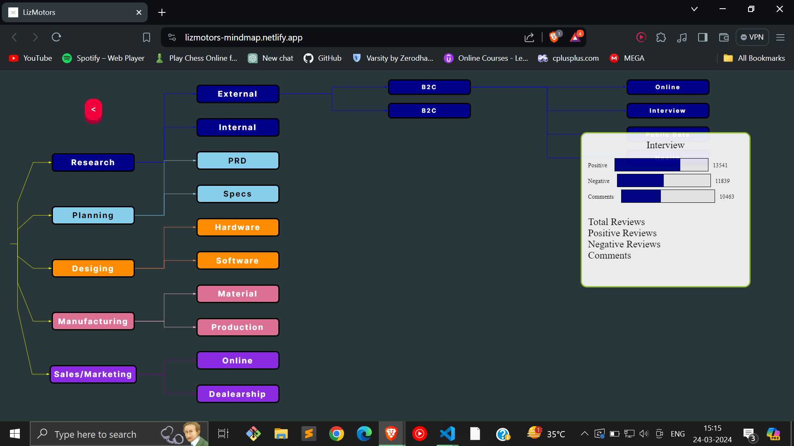
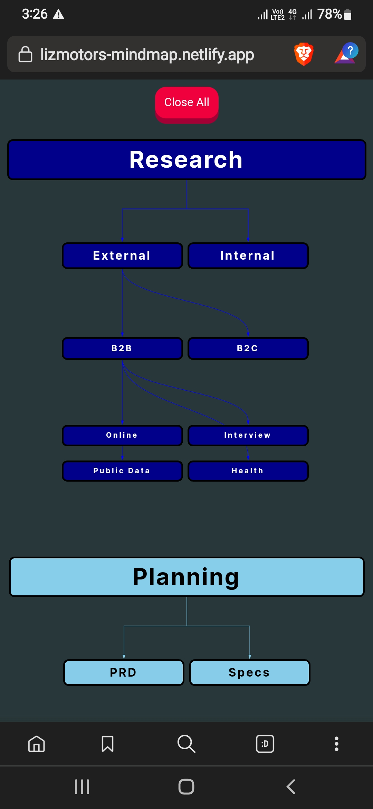

# Lizmotors Timeline Mindmap

## Desktop:

## Phone:

## Installation of React using Vite

`npm create vite@latest`

then 

`cd FolderName`

then

`npm i`

To Run

`npm run dev`

To Build

`npm run build`

## Installation of react-archer

`npm react-archer --save`

[react-archer GitHub](https://github.com/pierpo/react-archer/tree/master)